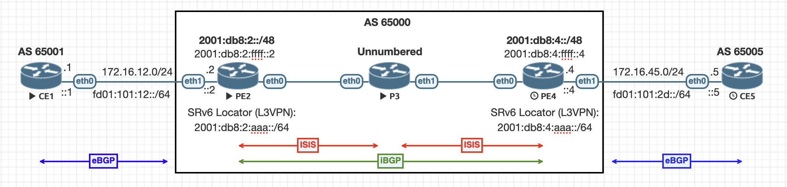

# Segment Routing IPv6 in VyOS

This lab accompanies an
[article](https://onvox.net/2024/02/01/srv6-vyos/) I published about configuring basic L3VPN using SRv6 on the VyOS routing platform.

## Files

| Filename          | Description                     |
|:------------------|:--------------------------------|
| eve-ng-export.zip | EVE-NG Lab export               |
| topology.png      | Topology diagram                |
| */config.boot     | VyOS startup configuration file |
| */config.commands | VyOS configuration commands     |
